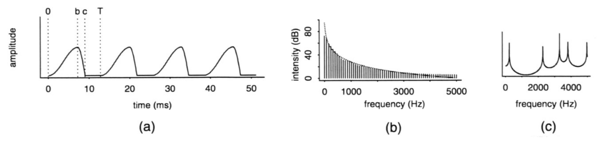
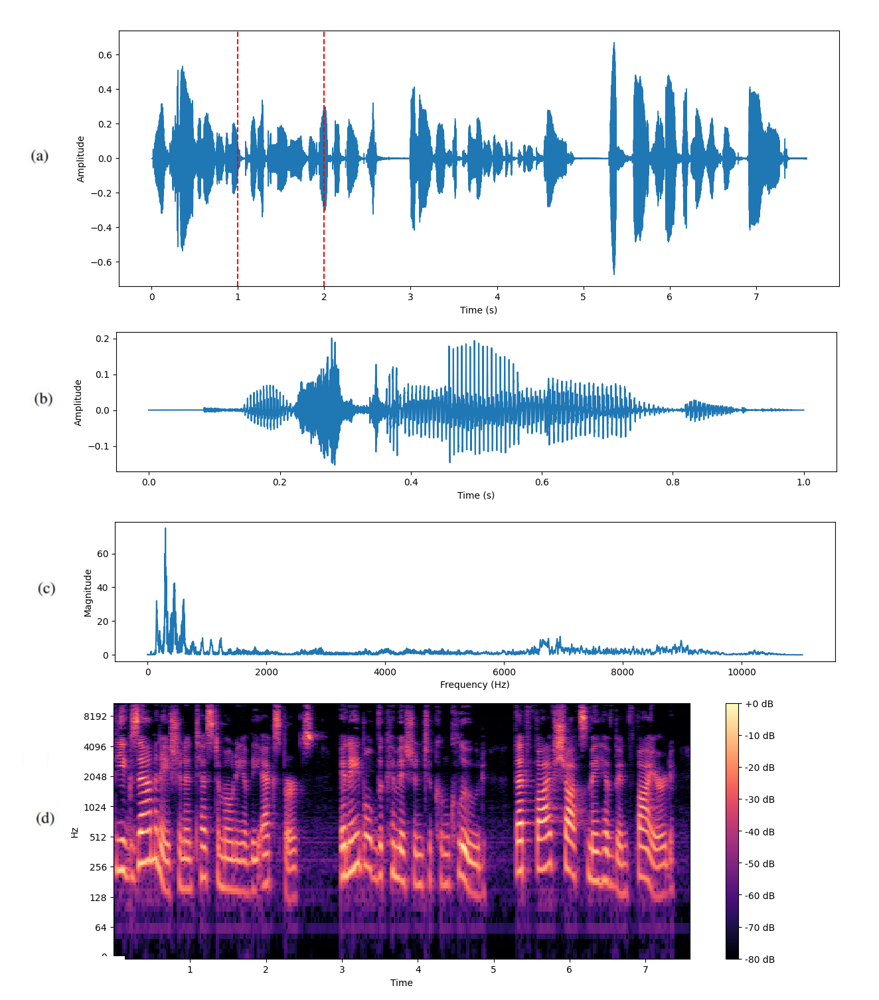
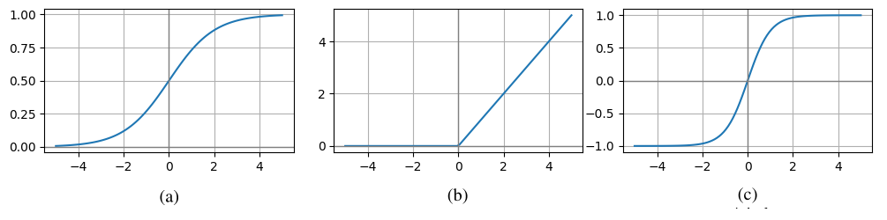
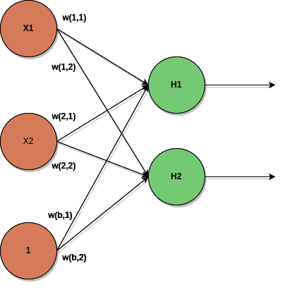
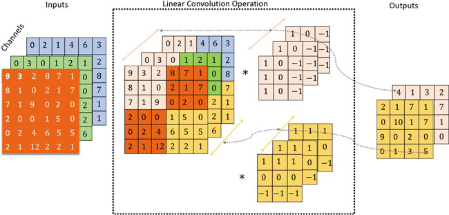

# Text-to-Speech system with expressiveness control based on diffusion probabilistic models

## Abstract

This thesis describes the research and experiments behind a TTS system aimed at generating natural human speech with expressiveness controllability. The resulting system is an attempt to tackle problems traditional approaches struggle with, such as lack of speech naturalness, insufficient systems' flexibility and the so called *one-to-many mapping problem*. The neural networks-based backbone of the system is data-driven, what allows to flexibly adjust it to either new data or different synthesis setups. The gap between the utterance's content and its style is alleviated by controlling the generated speech's style with Global Style tokens. In order to ensure diversity of the speaking style and to reduce the model's dependence on external inputs, the system is equipped with a module for style embedding prediction based on Denoising Diffusion Probabilistic Models. 

## Introduction

Text-to-Speech systems have undergone significant development over the last several years with the emerging dominance of neural networks-based approaches. Speech synthesis systems offer numerous potential applications, such as support for people with severe visual impairment, systems requiring convenient human-computer interfaces and, last but not least, various commercial applications like advertisements, audiobooks, computer games etc. 

The essential role of Text-to-Speech systems is to create a mapping between raw input content, i.e. characters from a chosen alphabet, and the desired output speech. This requires the system to use either provided or learned knowledge to generate desired sound representations (more in chapter [acoustic-features](#acoustic-featuresn)) that resemble the ones created by human articulatory system ([human-articulatory-system](#human-articulatory-system)).

### Challenges Text-to-Speech systems encounter

Since text and sound have different modalities and due to significant complexity of both human written and spoken language speech generation poses several problems. These obstacles have individual characteristics and therefore require individualized approaches. Several of the aforementioned problems involve:

- Complex sound representation
    - whereas elements of the written human language are not complicated per se (though they acquire complexity when analyzed within broader context - more about textual representations in chapter [natural-language-processing](#natural-language-processing)), all commonly used ways of representing sound involve low-level inter-dependencies which are difficult to track in rule-based systems.
- Dimensionality gap between text and speech
    - as Text-to-Speech systems become more complex and target better control over the generated speech, the dimensionality gap between the used textual and sound representations becomes a significant obstacle. The systems struggle to create a reliable mapping between the low-dimensional text and high-dimensional speech.
- The *One-to-Many mapping problem*
    - since each sentence may be pronounced in an infinite number of ways and the raw textual input lacks information about the desired speaking style, even systems based on monotonous single-speaker data fail to generate natural, expressive speech and instead tend to synthesize each utterance based on learned averaged mapping between groups of characters and corresponding sound samples.
- Dependence on hand-engineered features
    - due to high complexity of human speech many Text-to-Speech systems require long and difficult research on either human speech production or reception process. Though the resulting knowledge allows more advanced sound processing, the obtained sound representations are often too complex to be effectively managed, yet insufficient to be used in general-purpose systems. This makes the aforementioned approaches inflexible and difficult to maintain.    

Besides the problems related to the nature of speech synthesis, there are several often encountered difficulties that are related to the particular architectural solutions. These may be divided into groups as follows:  

- Information flow related:
    - Attention collapse - in systems using attention mechanism to guide the text-speech mapping it is often observed that the model fails to find the desired connection between input textual features (e.g. phonemes, characters) and the output acoustic features (e.g. mel-spectrogram frames). The models tend to relate respective sound representations to only a small subgroup of textual ones. This results in phenomena such as word-skipping, repeating or generating completely unintelligible speech. A comprehensive introduction to the attention mechanism can be found in chapter [attention](#attention).
    - Entanglement of acoustic features - whereas Text-to-Speech systems without style control usually see plain textual features as input, more complex systems, which additionally process input reference speech, have to deal with disentangling various layers of sound information. This enforces the application of complex architectural solutions such as adversarial training. More information can be found in chapter [expressive-tts](#expressive-tts).
- Performance related:
    - Slow inference speed - both traditional as well as auto-regressive neural-based approaches suffer from slow performance, what effectively prevents them from being used in real-time systems. More information about the auto-regressive generation can be found in chapter [generative-artificial-intelligence](#generative-artificial-intelligence). 
    - Significant memory-intensiveness - neural networks-based systems require access to large sets of parameters, which are often impossible to fit in the available RAM, especially on embedded systems. Additionally systems which are adaptable to new speakers (Adaptive Text-to-Speech) may be difficult to scale, since they require new parameters for each new user.

### Goals

In this thesis I propose a system aimed at generating human speech from textual prompt. In order to alleviate the problems named in chapter [challenges-text-to-speech-systems-encounter](#challenges-text-to-speech-systems-encounter) the proposed system includes several key solutions that have already been proven in the related work to mitigate the negative influence of the aforementioned challenges on the system.  

- The backbone of the system consists of neural-based modules and therefore is mostly data-driven, i.e. does not require complex hand-engineered features or solutions to guide the speech generation.
- The system's processing pipeline includes several non-overlapping steps, which operate on different complexity of textual and sound representations. This ensures stability of training and allows a better insight into the mapping algorithms learned by the neural models. Additionally it allows to guide the parts of the system to perform specific tasks and thereby facilitates dealing with the high sound representation dimensionality.
- In order to mitigate the gap between text and sound dimensionality the model uses **explicit length prediction** mechanism ([neural-based-systems-taxonomies](#neural-based-systems-taxonomies)) which is a commonly used technique and has been proven to reliably guide the model to match the input and output sequences.
- The *one-to-many mapping problem* is dealt with by providing the model with the desired speaking style via **Global Style Tokens** ([global-style-tokens](#global-style-tokens)). This not only helps model's training converge faster but also allows better control over the generated speech.
- In order to make the system more independent on the user's input, an additional module is created, whose role is to predict the best speaking style based on solely the input textual prompt. The module is trained according to the **Denoising Diffusion Probabilistic Models** approach.

### Thesis' structure

This paper is structured as follows:
1) the chapter [theoretical-foundation](#theoretical-foundation) focuses on presenting the main theoretical concepts crucial to the proposed system, including comprehensive explanations of the concepts and their application, as well as the commonly used taxonomies.
2) The chapter [related-work](#related-work) gives a comprehensive overview of various approaches to the Text-to-Speech task, focusing mainly on the neural-based systems, including both the evolution of the presented approaches and their contribution to the Speech Synthesis subject.
3) The chapter [proposed-system](#proposed-system) describes the proposed method to deal with the thesis' goals stipulated in [goals](#goals). It includes the description of the system's modules, neural models architecture and the overall setup used to train the models.
4) In chapter [experiments](#experiments) there's a detailed description of the system's setup, including the parameters of the neural architectures and the dataset used for training. It is followed with the system's evaluation and presentation of the obtained scores, including the Mean Opinion Score (MOS) evaluation as well as the ablation and case study.
5) Finally, the section [conclusions](#conclusions) concludes the thesis.

### List of abbreviations and acronyms

If not otherwise stated, the acronyms and abbreviations used in the following chapters should be decoded as follows:

- TTS - Text to Speech
- SS - Speech Synthesis
- GST - Global Style Tokens
- ESS - Expressive Speech Synthesis
- NN - Neural Networks
- LPC - Line Spectral Pairs
- MFCC - Mel Frequency Cepstral Coefficient
- HMM - Hidden Markov Model
- PCM - Pulse Code Modulation
- MOS - Mean Opinion Score
- ML - Machine Learning
- DL - Deep Learning
- NLP - Natural Language Processing
- FFT - Fast Fourier Transform
- G2P - Grapheme to Phoneme

## Theoretical foundation

The system behind this thesis on various levels of its components implements concepts from the domain of Deep Learning, Natural Language Processing, Audio Signal Processing and Speech Synthesis. Therefore the following chapter provides an explanation of the those concepts and the role they play in the system. The chapter has the following structure: .

### Speech signal processing

The audio signal, in its simplest form after being digitalized, does not provide any valuable information on sufficiently high level to be interpreted in terms of its properties resembling those of the human speech. It is the task of the sound processing techniques to divide the raw sound form into various levels of acoustic features. 

#### Digital sound coding

The storage and transmission sound requires it to be converted into the digital form. The used techniques of sound coding vary in terms of the used bit-rare (i.e. the number of beats used to encode each portion of the sound), complexity of the applied algorithms and the offered quality of encoded sound. The digital sound coding techniques may be roughly grouped as follows ([ss-and-sr-2001](#ss-and-sr-2001))):

- Simple waveform coders (e.g. PCM, Delta-Modulation)
  - don't analyze the sound in terms of its human speech properties
  - usually use high bit-rate (around 16 kbits/s and above) as they encode the sound using the most primitive properties of sine-wave
  - depending of the used algorithm's setup they can offer a good sound quality 
- Analysis-Synthesis systems (e.g. Linear Predictive Coding)
  - often try to break down the sound into a set of parameters, which allow to discard the information that does not explicitly stand for the properties of human-speech
  - compress the sound to lower bit-rates (4 kbits/s and below)
  - provide the tradeoff between the sound quality and the used level of compression, since they encode only the crucial parts of the input sound 

The most commonplace way of representing raw sound is called waveform, which can be obtained via technique called Pulse Code Modulation ([ss-and-sr-2001](#ss-and-sr-2001)). The PCM passes the input physical sound wave through an Analogue-to-Digital Converter (ADC) and records the sine-wave amplitude values in uniform intervals. The main parameters related to this form of sound representations are **sampling rate** and **bit depth**, which stand for respectively the number of recorded values per second and the number of bits used to encode each value. The PCM does not leverage any property of human production/reception except the limited range of frequencies human auditory system is able to process.

On of the most popular examples of analysis-synthesis methods of digital sound coding is Linear Predictive Coding ([speech-prod-models](#speech-prod-models)). It is inspired by the research on the human articulatory system (more in chapter [human-articulatory-system](#human-articulatory-system)) and consists in modeling each portion of sound as a digital filter, whose role is to mimic the way the human vocal system modifies the excitation signal produced by the lungs and vocal cords (modelled as either a pulse train constructed from the obtained fundamental frequency ([acoustic-features](#acoustic-features)) or a generated noise following the normal distribution).

#### Fourier Transform

Fourier Transform (FT) is a signal transformation, aimed at decomposing the input signal into particular frequencies it is composed from ([tts-xu-tan-2023](#tts-xu-tan-2023)). The basic form of the Fourier Transform operates on both continuous time and frequency. For purposes of transforming digital sound, a discrete version of the algorithm is applied in order to determine the contribution of a certain set of discrete frequencies and their corresponding phases to the final form of the signal. The range of the aforementioned frequencies depends strictly on the signal's sampling rate and can contain up to **Nyquist Frequency** value, i.e. half of the sampling rate. In practice the Fast Fourier Transform (FFT) is used, which is the optimized version of the algorithm. The formulas for the classical FT and DFT are available in [formula-fourier-transform](#formula-fourier-transform) (a) and (b) respectively.   

###### Formula Fourier Transform

a) 
$$X(\omega) = \sum_{n=-\infty}^\infty x[n] e^{-j\omega n}$$

b)
$$X[k] = \sum_{n=0}^{N-1} x[n] e^{-j \frac{2\pi}{N} k n}$$

a) Discrete-Time Fourier Transform resulting in continuous spectrum of frequencies a discrete signal contains. The `j` is the imaginary unit in Euler's formula $$e^{j\theta} = \cos(\theta) + j\sin(\theta)$$. The $$\omega$$ is the analog radian frequency divided by the signal's sampling rate. The intuition behind the formula is that the more the input signal is in line with a given frequency, the more will it strengthen the average value of the complex sequence $$e^{-j \frac{2\pi}{N} k n}$$. The sum for every `k` is also a complex number, where its length stands for the magnitude of the given frequency and its angle for the phase.
b) Formula of the Discrete Fourier Transform.

#### Human articulatory system

Some of the characteristics of human speech, also used in neural-based TTS systems, come from studies on human system of speech production. According to the model presented in [acoustic-theory-speech-prod](#acoustic-theory-speech-prod) the full process, within which the speech is produced, can be divided into four phases:

1. Sound source - includes the vibrations created by vocal folds excited by the airflow from the lungs. This part accounts for the basic characteristics of the created sound, e.g. whether it should be a consonant, created by a turbulent airstream, or a vowel, commonly described as one of the *voiced sounds*. 
2. Vocal tract - describes the shape of human vocal system, which is responsible for shaping the tone created by the glottis. It acts as a filter for the regular sound created by the vocal folds.
3. Energy losses - accounts for amplification of certain frequencies in the sound, which plays a crucial role in creating *nasal sounds*.
4. Sound radiation - describes the properties the final speech acquires while radiating from the mouth.

This description of the aforementioned process has been used to create the **source-filter** model, which allows to divide the speech production into to parts, where the first accounts for the properties of the sound leaving the glottis and the second describes the filtering process, where the glottal pulse is shaped into its final form. This process is visualized in figure [figure-source-filter-model](#figure-source-filter-model) .

###### Figure Source Filter Model

Visualizations of the speech transformations within particular parts of the process of articulation. Reproduced from [ss-and-sr-2001](#ss-and-sr-2001).
a) The dependence of the vocal cords' openness on time. The (0,b) time range stands for the rising phase, the (b, c) is the closing phase and the (b, T) is the time when the vocal cords are fully closed.
b) The spectrum of the sound after the *glottal source* phase.
c) The spectrum of the vocal tract filter.

#### Acoustic features

Since raw waveform is an extremely complex sound representation, where the dependencies between particular samples are difficult to tract, both TTS and Speech Recognition systems usually have to operate on high-level sound features. Those not only are easier to handle but also display properties specific to the way humans speak or hear. The acoustic features may be divided into groups according to the level of speech, on which they are visible and where they play their crucial role.

The commonly used acoustic features are:

1. Spectrogram
   - is a 2D sound representation and consists of stacked spectra obtained by applying FFT on consecutive frames extracted from the discrete signal. Such transformation is called Short Time Fourier Transform (STFT) and is portrayed on figure [short-time-fourier-transform](#short-time-fourier-transform). Since sensitivity of human ear against frequencies is rather logarithmic than linear, in practice spectrograms in **Mel** frequency scale are used.  
2. Mel Frequency Cepstral Coefficients
   - are obtains by applying the Discrete Cosine Transform (DCT) on natural logarithm of the mel-spectrum of the sound. This representation is especially useful in Automatic Speech Recognition techniques, since it emphasizes the formants (i.e. the primary frequencies, whose configurations are present in vowels) in human speech.
3. Fundamental frequency
   - often denoted as F0 is the lowest frequency in the sound's spectrum. It is often referred to as the pitch.
4. Energy
   - obtained by computing the sum of signal values raised to the power of 2.

###### Short Time Fourier Transform

Visualization of the consecutive steps of the Short Time Fourier Transform.
a) Raw waveform with a fragment marked in red, which is going to be the FFT's input.
b) The extracted marked fragment after applying the Hann window function.
c) Spectrum obtained from the fragment.
d) Full spectrogram obtained from the raw waveform.

### Natural language processing

Natural Language Processing (NLP) is an integral part of every TTS pipeline and its role is to analyze the raw input text, most of the time in form of characters belonging to a chosen alphabet, and convert it to high-level representations, more fit to the SS task. As stated in [xu-tan-survey](#xu-tan-survey), complex pre-processing of the input text was crucial in both traditional and early neural-based systems, as it allowed to properly guide the generation even without good modelling capacity, offered by the contemporary systems. With the emergence and popularization of more End-to-End TTS pipelines some of the previously used NLP techniques have largely fallen by the sideway and have been forced out by simpler, yet less effort-consuming processing.

Extracting both syntactic and semantic representations from the input text leverages the knowledge on the subject of natural language. The obtained textual features may alleviate the complexity of the information conveyed by the text by providing the model with the external knowledge, what frees it from learning it on its own.

#### Text Normalization

Text normalization is the process of converting non-orthographic words into a form understandable by the model ([tts-xu-tan-2023](#tts-xu-tan-2023)). This applies especially to systems trained on massive amounts of data, often scraped in raw form from the Internet, which expert analysts are unable to normalize manually. Such words may include:

- Acronyms (e.g. FFT may be either unwrapped into Fast Fourier Transform or be read letter by letter)
- Abbreviations (e.g. Mr. Myers for Mister Myers)
- Numbers in various forms (e.g. date 2005-04-02, time 9:37 pm, currency formats, ordinal numbers)
- Mathematical and chemical formulas

In order to better guide the model to learn relationships between the textual input and its corresponding sound units, all the aforementioned forms must be turned into speakable expressions, resembling the way a human would enunciate them. The same applies for systems incorporating G2P conversion ([grapheme-to-phoneme-conversion](#grapheme-to-phoneme-conversion)) into their preprocessing pipeline. As [xu-tan-survey](#xu-tan-survey) states, the available tools performing text normalization have largely undergone an evolution, often replacing the traditional rule-based approaches with the neural-based ones.

#### Segmentation

Word/Phrase Segmentation is especially significant in systems which operate on language without explicit separation of sentence's parts. For instance, in Chinese all characters belonging to a sentence are aligned together, one by one, and separating them requires knowledge about either the rules of words construction or about their meaning. Marking the individual words or phrases is crucial for proper determining of the pronunciation,  stress and intonation. 

#### Part-of-Speech Tagging

The part-of-speech (POS) tagging is significant form the perspective of phonetic analysis of the sentence, since the role a word plays with respect to the other ones has much influence on the way it should be pronounced. This applies to the proper intonation of a word as well as disambiguation between homographs (i.e. words with the same spelling but different meanings, e.g. the word "bear") and the words with different spelling depending on the context (e.g. the word "read" in present and past tenses).

#### Grapheme-to-Phoneme Conversion

G2P Conversion is the process of converting sequences of characters (graphemes) in their pronunciations (phonemes). This allows to disambiguate the proper spelling of words in languages in which it may differ, depending on both the meaning and structure of the word (e.g. the english words *recipe* and *recite*, though they have similar structures, are pronounced *R IH S AY T* and *R EH S IH P IY*). The used G2P tool largely depends on the analyzed alphabet, e.g. in order to convert Chinese characters into their corresponding phonetic transcription codes a large dictionary may be used, whereas english words need a specialized G2P model.

### Basics of Deep Learning

Deep Learning (DL) has emerged from the domain of Machine Learning with the popularization of Deep Neural Networks (DNNs), i.e. models defining relationships between groups of numerical parameters and transformations applied to them. DNN-based architectures are known do display strong modelling capabilities and may be used to simulate an arbitrary function that maps a given input to the desired output. DNNs are applied especially to tasks, where the model's inputs contain complex non-linear inter-relationships, either spatial and temporal. For this reason they are often used to tasks like image classification (i.e. mapping input image tensors to class signatures), text-to-speech synthesis, time series prediction.

#### Basic concepts

Beside various specialized neural-based architectures the DL field has developed a set of techniques, paradigms and conventions, aimed at creating effective frameworks for building DL-based systems.

**Forward Pass** is the full complex transformation a neural network applies to its inputs. At the lowest level it consists of primitive mathematical operations performed between numerical values (e.g. multiplication between model's parameters and inputs), which eventually result in the possibly multivariate model's output. The exact applied transformations vary and depend on the model's architecture.   

**Activation functions** are functions applied to the values flowing through a network. Their role is to provide non-linearity to the model, what allows to find complex inter-relationships between the processed values. Examples of commonly-used activation functions are available on figures [figure-activation-functions](#figure-activation-functions) a), b) and c).

**Loss functions** are functions computed from the DL model's output in order to provide it with a guiding signal allowing to evaluate its performance and to estimate the desired direction of improvement with respect to the model's parameters. An example loss function used mostly for regression is Mean Squared Error (MSE), computed as the arithmetic mean of squared differences between the computed and ground-truth outputs. 

**Backpropagation** is a gradient estimation algorithm, whose role is to determine the gradient of the used loss function with respect to the model's parameters. The algorithm allows to omit time-consuming computations, necessary to obtain the gradient of a complex multi-variate function by computing the limit of the difference quotient. The Backpropagation algorithm uses the **Chain Rule**, which can be expressed as $$\frac{\partial L}{\partial w} = \frac{\partial L}{\partial a} \cdot \frac{\partial a}{\partial z} \cdot \frac{\partial z}{\partial w}$$.

###### Figure activation functions

Example activation functions used in DL models.
a) Sigmoid: $$\sigma (x)={\frac {1}{1+e^{-x}}}$$.
b) Rectified Linear Unit (ReLU):$$\text{ReLU}(x) = \max(0, x)$$.
c) Hyperbolic Tangent (Tanh):$$\text{Tanh}(x) = \frac{\sinh(x)}{\cosh(x)} = \frac{e^x - e^{-x}}{e^x + e^{-x}}$$.

#### Neural Networks

The primary building blocks of NNs, called *perceptrons*, are loosely inspired by the shape and functioning of human neurons. It is an abstract structure, often depicted in graph form as a single node, with a set of parameters called *weights*. With every forward pass, the perceptron outputs a value, which is the weighted sum of all its inputs passed through a chosen activation function. First perceptrons used step functions shown below as their activations.

$$f(x) =
\begin{cases}
1 & \text{if } x \geq 0, \\
0 & \text{if } x < 0.
\end{cases}$$

In order to increase their modelling potential, layers of perceptrons are stacked together, resulting in Multi Layer Perceptron (MLP). In this structure every neuron of the *l+1* layer has its weights connected to every neuron from the *l* layer. For this reason MLPs are often called *Dense* or *Fully Connected* layers. The figure [figure-mlp](#figure-mlp) shows a visualization of MLP.   

###### Figure mlp

Visualization of the Multi Layer Perceptron, borrowed from [dl-for-nlp-sr](#dl-for-nlp-sr). The orange nodes are layer's inputs together with an additional *bias* input equal to 1. The green nodes symbolize layer's neurons.

#### Convolutional layers

Although thanks to their modelling capacity MLPs have been successfully applied to many tasks, the offered dense connectivity has two primary disadvantages: 1) It involves a heavy computational cost. 2) The fully connected networks are unable to focus on certain low-level local relationships between input samples. For this reason a separate type of neural network has emerged ([dl-for-nlp-sr](#dl-for-nlp-sr)), which is inspired by the *convolution* operation from the field of image processing. In discrete domain the convolution may be formulated as:

$$(f * g)[n] = \sum_{k=-\infty}^{\infty} f[k] \cdot g[n - k]$$

where the $$f(x)$$ function is generally known as the *kernel*. In practice, inspired by the field of image processing, a finite-dimensional kernel with finite number of parameters on each axis is used and its application to the input tensor may be visualized as sliding an n-dimensional window across the input, where every output value is computed as the sum of weighted input values. The difference between MLPs and Convolutional Neural Networks (CNNs) is in *sparse connectivity* and *parameter sharing*. A visualization of the CNN forward pass is depicted on figure [figure-cnn](#figure-cnn).

Convolutional layers display a good ability to find local spatial relationships between input samples. For this reason they are often applied to tasks, where patterns in the input data are to be found within local contexts, such as all kinds of tasks which involve image processing. The forward pass of the CNNs-based models can be easily parallelized. 

###### Figure CNN

Convolutional Neural Network's forward pass, borrowed from [dl-for-nlp-sr](#dl-for-nlp-sr). The input to the layer is a tensor, which consists of three layers of 2D matrices. The convolutional layer has two 2D kernels, which are applied to each input matrix, resulting in two output matrices.

#### Recurrent layers

In order to find temporal relationships in the input data, Recurrent Neural Networks (RNNs) have been developed ([generative-models-auto-regressive-review](#generative-models-auto-regressive-review)). Their characteristic property is that instead of single input tensors they consume whole sequences, processing an input sample at time *t* and using the intermediate result while processing the sample *t+1*.

The RNN's parameters are trained via **Backpropagation Through Time**, which involves unfolding of the whole sequence's transformation. In early recurrent architectures the training was noticeably unstable, due to the problems of *exploding gradient* and *vanishing gradient*, which are caused by repeated multiplication of the same parameters and consisted in either rapid soaring or collapsing of the computed gradient, what significantly hinders the training. For this reason new architectures have been developed, including Long Short-Term Memory (LSTM) and Gated Recurrent Unit (GRU) networks.

#### Attention

Early Sequence-to-Sequence mapping models, using RNNs to catch temporal dependencies, often used the Encoder-Decoder scheme for auto-regressive generation ([generative-artificial-intelligence](#generative-artificial-intelligence)), depicted on figure . The whole information from the encoder's input would be squashed into a single vector and then used as the first decoder's state. Such setup has been observed to fail to catch long-range dependencies, what resulted in poor generation capability.

The general idea of the Attention mechanism is that the model is given the possibility to come up with the best encoder-decoder connection on its own. This involves computing the vector containing averaged encoder's hidden states individually for each decoder's step. The first version of the mechanism, so called Soft-Attention, was proposed in [generative-models-attention-align](#generative-models-attention-align). Attention allows each decoder's step to draw the 

#### Transformers

### Generative Artificial Intelligence

### Classical TTS

#### Traditional approaches

#### TTS pipeline

#### Neural-based systems taxonomies

### Expressive TTS

#### One-to-Many Mapping Problem

#### Taxonomy of approaches

#### Global Style Tokens

#### Disentangling speech features

## Related work

## Proposed system

## Experiments

## Conclusions

### Further research

## References

###### dl-for-nlp-sr

- [Deep Learning for NLP and Speech Recognition](https://link.springer.com/book/10.1007/978-3-030-14596-5)

###### tts-xu-tan-2023
- [Xu Tan (2023): *Neural Text-to-Speech Synthesis*](https://link.springer.com/book/10.1007/978-981-99-0827-1)

###### speech-prod-models

- [A Tutorial on Speech Synthesis Models](https://www.sciencedirect.com/science/article/pii/S1877050915035097)

###### acoustic-theory-speech-prod

- [The Acoustic Theory of Speech Production](https://link.springer.com/chapter/10.1007/978-94-011-4657-9_3)

###### ss-and-sr-2001

- [John Holmes, Wendy Holmes: *Speech Synthesis and Recognition*](https://www.routledge.com/Speech-Synthesis-and-Recognition/Holmes/p/book/9780748408573?srsltid=AfmBOoqr5b8kB0bliVJhhvUbgH0_BAaCs-A5K0KjV6J2x5NIASVBx2r2)

###### xu-tan-survey

- [A Survey on Neural Speech Synthesis](https://arxiv.org/abs/2106.15561)

###### tts-ddpm-diff-tts
- [Diff-TTS: A Denoising Diffusion Model for Text-to-Speech](https://arxiv.org/abs/2104.01409)

###### tts-ddpm-diffwave
- [DiffWave: A Versatile Diffusion Model for Audio Synthesis](https://arxiv.org/abs/2009.09761)

###### tts-ar-wavenet
- [WaveNet: A Generative Model for Raw Audio](https://arxiv.org/abs/1609.03499)

###### tts-ar-natural-tts
- [Natural TTS Synthesis by Conditioning WaveNet on Mel Spectrogram Predictions](https://arxiv.org/abs/1712.05884)

###### tts-ar-transformer
- [Neural Speech Synthesis with Transformer Network](https://arxiv.org/abs/1809.08895)

###### tts-ar-tacotron
- [Tacotron: Towards End-to-End Speech Synthesis](https://arxiv.org/abs/1703.10135)

###### tts-parallel-deep-voice3
- [Deep Voice 3: Scaling Text-to-Speech with Convolutional Sequence Learning](https://arxiv.org/abs/1710.07654)

###### tts-parallel-deep-voice
- [Deep Voice: Real-time Neural Text-to-Speech](https://arxiv.org/abs/1702.07825)

###### tts-parallel-fastpitch
- [FastPitch: Parallel Text-to-speech with Pitch Prediction](https://arxiv.org/abs/2006.06873)

###### tts-parallel-fast-speech
- [FastSpeech: Fast, Robust and Controllable Text to Speech](https://arxiv.org/abs/1905.09263)

###### tts-parallel-fast-speech2
- [FastSpeech 2: Fast and High-Quality End-to-End Text to Speech](https://arxiv.org/abs/2006.04558)

###### tts-parallel-jdi-t
- [JDI-T: Jointly trained Duration Informed Transformer for Text-To-Speech without Explicit Alignment](https://arxiv.org/abs/2005.07799)

###### tts-parallel-wavegan
- [Parallel WaveGAN: A fast waveform generation model based on generative adversarial networks with multi-resolution spectrogram](https://arxiv.org/abs/1910.11480)

###### expressive-tts-review
- [Deep learning-based expressive speech synthesis: a systematic review of approaches, challenges, and resources](https://asmp-eurasipjournals.springeropen.com/articles/10.1186/s13636-024-00329-7)

###### expressive-tts-gst-style-tokens
- [Style Tokens: Unsupervised Style Modeling, Control and Transfer in End-to-End Speech Synthesis](https://arxiv.org/abs/1803.09017)

###### expressive-tts-gst-emotional-tts
- [End-to-End Emotional Speech Synthesis Using Style Tokens and Semi-Supervised Training](https://arxiv.org/abs/1906.10859)

###### expressive-tts-gst-enhancing-speaking-styles
- [Enhancing Speaking Styles in Conversational Text-to-Speech Synthesis with Graph-based Multi-modal Context Modeling](https://arxiv.org/abs/2106.06233)

###### expressive-tts-gst-word-level-style
- [Extracting and Predicting Word-Level Style Variations for Speech Synthesis](https://ieeexplore.ieee.org/document/9410373)

###### expressive-tts-gst-hierarchical
- [Learning Hierarchical Representations for Expressive Speaking Style in End-to-End Speech Synthesis](https://ieeexplore.ieee.org/document/9003859)

###### expressive-tts-gst-mellotron
- [Mellotron: Multispeaker expressive voice synthesis by conditioning on rhythm, pitch and global style tokens](https://arxiv.org/abs/1910.11997)

###### expressive-tts-in-context-zero-shot
- [Neural Codec Language Models are Zero-Shot Text to Speech Synthesizers](https://arxiv.org/abs/2301.02111)

###### expressive-tts-adaptive-adaspeech
- [AdaSpeech: Adaptive Text to Speech for Custom Voice](https://arxiv.org/abs/2103.00993)

###### expressive-tts-prosody-tacotron
- [Towards End-to-End Prosody Transfer for Expressive Speech Synthesis with Tacotron](https://arxiv.org/abs/1803.09047)

###### expressive-tts-prosody-hierarchical
- [Towards Expressive Speaking Style Modelling with Hierarchical Context Information for Mandarin Speech Synthesis](https://arxiv.org/abs/2203.12201)

###### expressive-tts-prosody-multi-speaker
- [Multi-Speaker Emotional Speech Synthesis with Fine-Grained Prosody Modeling](https://ieeexplore.ieee.org/document/9413398)

###### generative-models-ddpm-denoising
- [Denoising Diffusion Probabilistic Models in Six Simple Steps](https://arxiv.org/abs/2402.04384)

###### generative-models-attention-align
- [Neural Machine Translation by Jointly Learning to Align and Translate](https://arxiv.org/abs/1409.0473)

###### generative-models-attention-all-you-need
- [Attention Is All You Need](https://arxiv.org/abs/1706.03762)

###### generative-models-auto-regressive-review
- [A Critical Review of Recurrent Neural Networks for Sequence Learning](https://arxiv.org/abs/1506.00019)

###### other-audio-compression
- [High Fidelity Neural Audio Compression](https://arxiv.org/abs/2210.13438)
