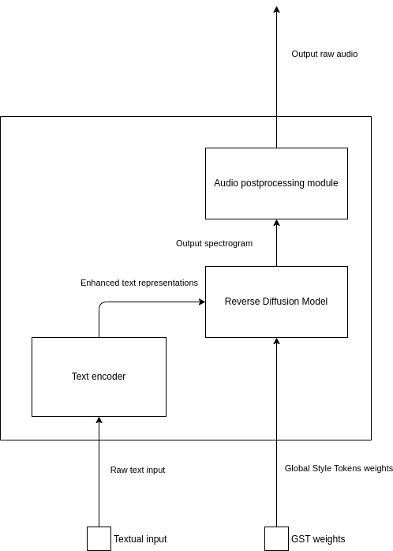
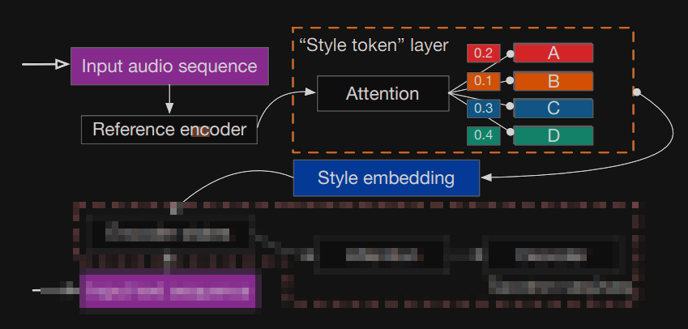
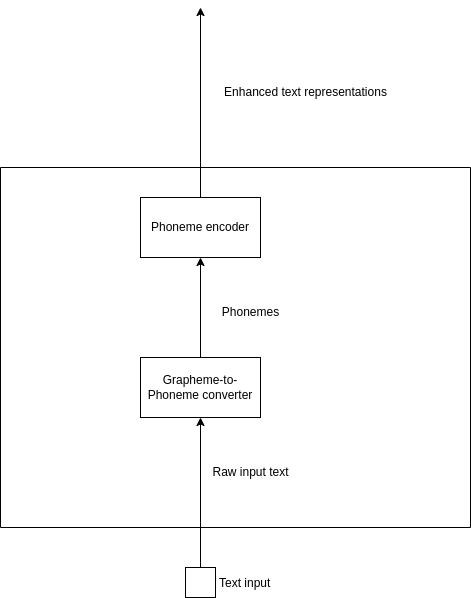
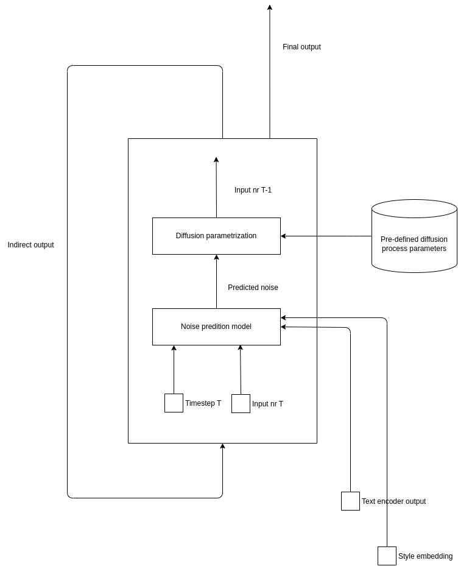
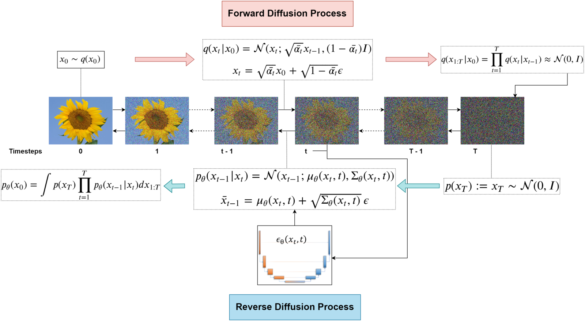

# Human speech synthesis system based on Denoising Diffusion Probabilistic Models using Global Style Tokens for expressiveness and controllability 

The system performs a TTS task using textual prompt and style labels as input ports.

1. The basic role of the system is to generate natural human speech from input text
   - the system's output is a waveform audio converted from a mel-scale spectrogram
   - the system shall generate a spectrogram that is the most probable i.e. the likelihood of its values is optimized in terms of the data the system has been trained on  
   - the system's backbone are neural network-based modules  
2. The generation task is based on a modern approach to training parameters of a generative model
   - the Denoising Diffusion Probabilistic Models concept is applied, which consists in gradually reducing the amount of noise in a randomly generated tensor until its values resemble the probability distribution of real data
3. The style input is provided via so called Global Style Tokens whose interpretation is to be derived after the neural model has been learned. This means the training of the model is an example of Unsupervised Machine Learning task.

## System overview

### Global Style Tokens

*Source: [Style Tokens: Unsupervised Style Modeling, Control and Transfer in End-to-End Speech Synthesis](https://arxiv.org/abs/1803.09017)*

Style tokens are randomly initialized vectors whose role is to serve as pseudo-labels representing style of the generated utterance. They provide the style information insofar, as their weighted sum serves as a style embedding used by te model to condition the speech generation.

In practice the initialized tokens are used as both keys and values to an attention system whose weights are to be tailored within the training process. In inference time the weights may be chosen manually. In training time the weights are computed based on acoustic input, such as an embedding converted from the reference speech.

### Text encoder

The role of the encoder is to convert a raw textual input into tensor containing meaningful enhanced text representations that shall be used by the decoder to support the conditional generation task.

#### Grapheme-to-Phoneme converter

Is either a neural-network based or a rule-based pre-trained module, whose role is to convert raw textual input (consisting of ASCII characters) into phonemes (consisting of characters coming from a pre-defined phoneme alphabet).

#### Phoneme encoder

Is a neural-based module processing the input one-hot encoded phonemes into representations that are meaningful to the module responsible for conditional-generating output speech. Since the encoder processes its input in a non-autoregressive manner, its allowed to use bidirectional NN layers such as Convolutional layers or Bidirectional LSTM layers.

### Reverse Diffusion Model

The role of the Reverse Diffusion Model is to perform the whole chain of tensor denoising until its considered to be a noiseless spectrogram, suited to be converted into the output raw speech.

#### Parametrizing the diffusion process

Every intermediate step together with the timestep number are input to a parametrized neural network whose role is to predict the amount of noise to be subtracted from the input. The predicted noise is used by the Difffusion Parametrization module to create the next step.

*Source: [An In-Depth Guide to Denoising Diffusion Probabilistic Models DDPM – Theory to Implementation](https://learnopencv.com/denoising-diffusion-probabilistic-models/)*

### Audio postprocessing module

The role of the postprocessing step is to decode the spectrogram generated within the reverse diffusion process into either a linear spectrogram or a ra waveform audio. This module may be a parametrized neural network or a parameter-less algorithm such as Griffin-Lim algorithm.

## References

### TTS

- [Xu Tan (2023): *Neural Text-to-Speech Synthesis*](https://link.springer.com/book/10.1007/978-981-99-0827-1)

- DDPM-based models
  - [Diff-TTS: A Denoising Diffusion Model for Text-to-Speech](https://arxiv.org/abs/2104.01409)
  - [DiffWave: A Versatile Diffusion Model for Audio Synthesis](https://arxiv.org/abs/2009.09761)

- Auto-regressive models
  - [WaveNet: A Generative Model for Raw Audio](https://arxiv.org/abs/1609.03499)
  - [Natural TTS Synthesis by Conditioning WaveNet on Mel Spectrogram Predictions](https://arxiv.org/abs/1712.05884)
  - [Neural Speech Synthesis with Transformer Network](https://arxiv.org/abs/1809.08895)
  - [Tacotron: Towards End-to-End Speech Synthesis](https://arxiv.org/abs/1703.10135)

- Parallel models
  - [Deep Voice 3: Scaling Text-to-Speech with Convolutional Sequence Learning](https://arxiv.org/abs/1710.07654)
  - [Deep Voice: Real-time Neural Text-to-Speech](https://arxiv.org/abs/1702.07825)
  - [FastPitch: Parallel Text-to-speech with Pitch Prediction](https://arxiv.org/abs/2006.06873)
  - [FastSpeech: Fast, Robust and Controllable Text to Speech](https://arxiv.org/abs/1905.09263)
  - [FastSpeech 2: Fast and High-Quality End-to-End Text to Speech](https://arxiv.org/abs/2006.04558)
  - [JDI-T: Jointly trained Duration Informed Transformer for Text-To-Speech without Explicit Alignment](https://arxiv.org/abs/2005.07799)
  - [Parallel WaveGAN: A fast waveform generation model based on generative adversarial networks with multi-resolution spectrogram](https://arxiv.org/abs/1910.11480)

### Expressive TTS
  
- [Deep learning-based expressive speech synthesis: a systematic review of approaches, challenges, and resources](https://asmp-eurasipjournals.springeropen.com/articles/10.1186/s13636-024-00329-7)

- GST
  - [Style Tokens: Unsupervised Style Modeling, Control and Transfer in End-to-End Speech Synthesis](https://arxiv.org/abs/1803.09017)
  - [End-to-End Emotional Speech Synthesis Using Style Tokens and Semi-Supervised Training](https://arxiv.org/abs/1906.10859)
  - [Enhancing Speaking Styles in Conversational Text-to-Speech Synthesis with Graph-based Multi-modal Context Modeling](https://arxiv.org/abs/2106.06233)
  - [Extracting and Predicting Word-Level Style Variations for Speech Synthesis](https://ieeexplore.ieee.org/document/9410373)
  - [Learning Hierarchical Representations for Expressive Speaking Style in End-to-End Speech Synthesis](https://ieeexplore.ieee.org/document/9003859)
  - [Mellotron: Multispeaker expressive voice synthesis by conditioning on rhythm, pitch and global style tokens](https://arxiv.org/abs/1910.11997)

- In-context approaches
  - [Neural Codec Language Models are Zero-Shot Text to Speech Synthesizers](https://arxiv.org/abs/2301.02111)

- Adaptive TTS
  - [AdaSpeech: Adaptive Text to Speech for Custom Voice](https://arxiv.org/abs/2103.00993)

- Prosody encoding
  - [Towards End-to-End Prosody Transfer for Expressive Speech Synthesis with Tacotron](https://arxiv.org/abs/1803.09047)
  - [Towards Expressive Speaking Style Modelling with Hierarchical Context Information for Mandarin Speech Synthesis](https://arxiv.org/abs/2203.12201)
  - [Multi-Speaker Emotional Speech Synthesis with Fine-Grained Prosody Modeling](https://ieeexplore.ieee.org/document/9413398)

### Generative models

- DDPM
  - [Denoising Diffusion Probabilistic Models in Six Simple Steps](https://arxiv.org/abs/2402.04384)

- Attention
  - [Neural Machine Translation by Jointly Learning to Align and Translate](https://arxiv.org/abs/1409.0473)
  - [Attention Is All You Need](https://arxiv.org/abs/1706.03762)

- Auto-regressive
  - [A Critical Review of Recurrent Neural Networks for Sequence Learning](https://arxiv.org/abs/1506.00019)

### Other

- [High Fidelity Neural Audio Compression](https://arxiv.org/abs/2210.13438)